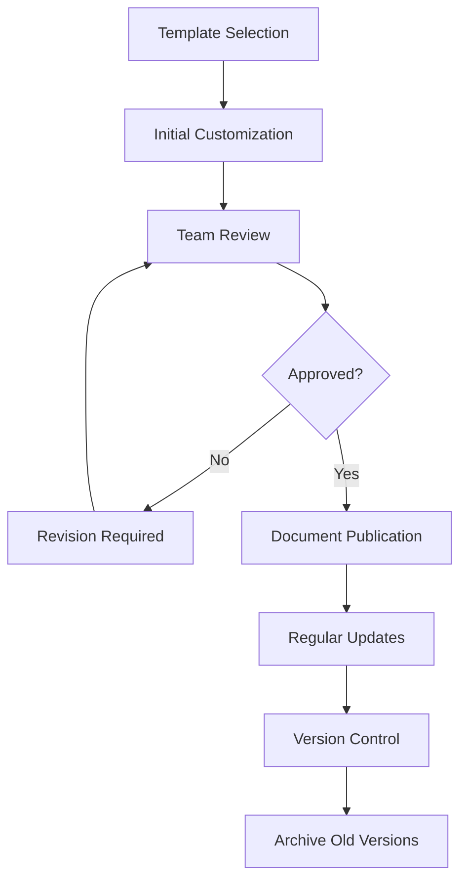

# Document Templates Collection

Professional templates for comprehensive Roblox game development documentation.

## 📁 Template Overview

### 🎨 [Game Design Document](game_design_document.md)
**Purpose:** Complete game design specification and vision document  
**Use When:** Starting a new project or formalizing game concepts  
**Audience:** Development team, stakeholders, investors

**Key Sections:**
- Game overview and vision
- Core gameplay mechanics and loops
- Target audience analysis
- Technical architecture overview
- Art and audio direction
- Monetization strategy
- Development timeline
- Risk assessment

**Benefits:**
- Aligns team on game vision and scope
- Provides comprehensive project roadmap
- Facilitates stakeholder communication
- Serves as reference throughout development

---

### 📖 [Project README](project_README.md)
**Purpose:** Professional project documentation for repositories and public-facing information  
**Use When:** Setting up project repository or preparing for open source release  
**Audience:** Developers, contributors, community members

**Key Sections:**
- Project overview and features
- Installation and setup instructions
- Development environment configuration
- API documentation and usage examples
- Contributing guidelines
- Performance metrics and analytics
- Support and community links

**Benefits:**
- Professional project presentation
- Clear onboarding for new developers
- Community engagement facilitation
- Technical documentation standards

---

### 🏗️ [Technical Specification](technical_specification.md)
**Purpose:** Detailed technical architecture and implementation documentation  
**Use When:** Finalizing technical architecture or onboarding senior developers  
**Audience:** Technical team, system architects, senior developers

**Key Sections:**
- System architecture diagrams
- Component specifications and interfaces
- Data flow and persistence design
- Network protocol documentation
- Security and anti-cheat measures
- Performance requirements and optimization
- Testing and deployment strategies

**Benefits:**
- Clear technical communication
- Reduced integration complexity
- Consistent implementation standards
- Technical debt prevention

---

### 🧪 [Testing Plan](testing_plan.md)
**Purpose:** Comprehensive quality assurance and testing strategy  
**Use When:** Preparing for testing phases or establishing QA processes  
**Audience:** QA team, developers, project managers

**Key Sections:**
- Testing objectives and success criteria
- Test scope and methodology
- Cross-platform testing matrix
- Performance and security testing
- Bug reporting and tracking procedures
- Test automation strategies
- Quality metrics and KPIs

**Benefits:**
- Systematic quality assurance
- Reduced post-launch issues
- Clear testing responsibilities
- Professional QA standards

---

### 📈 [Marketing Plan](marketing_plan.md)
**Purpose:** Complete marketing strategy and campaign execution plan  
**Use When:** Preparing for game launch or marketing campaigns  
**Audience:** Marketing team, community managers, business stakeholders

**Key Sections:**
- Target audience analysis and segmentation
- Marketing objectives and KPIs
- Multi-channel marketing strategy
- Content calendar and creation guidelines
- Influencer partnership framework
- Budget allocation and ROI tracking
- Crisis management procedures

**Benefits:**
- Strategic marketing approach
- Coordinated campaign execution
- Measurable marketing outcomes
- Professional marketing standards

---

## 🚀 Quick Start Guide

### Using Templates Effectively

#### 1. **Choose the Right Template**
```
New Project → Start with Game Design Document
Technical Planning → Use Technical Specification
Repository Setup → Begin with Project README
Quality Assurance → Implement Testing Plan
Launch Preparation → Develop Marketing Plan
```

#### 2. **Customize for Your Project**
- Replace all `[Bracketed Placeholders]` with your specific information
- Adapt sections to match your project scope and complexity
- Remove irrelevant sections and add project-specific content
- Maintain consistent formatting and professional tone

#### 3. **Collaborative Development**
- Share templates with team members for input
- Use version control for document management
- Establish regular review and update schedules
- Maintain cross-references between related documents

### Template Customization Examples

#### Small Indie Project
```yaml
Recommended Templates:
  - Game Design Document (Simplified)
  - Project README (Essential sections only)
  - Testing Plan (Basic QA checklist)

Focus Areas:
  - Core gameplay mechanics
  - Technical feasibility
  - Basic marketing approach
```

#### Medium Studio Project
```yaml
Recommended Templates:
  - Complete Game Design Document
  - Technical Specification (Core systems)
  - Project README (Full documentation)
  - Testing Plan (Structured QA)
  - Marketing Plan (Strategic approach)

Focus Areas:
  - Detailed system design
  - Cross-platform considerations
  - Team coordination processes
```

#### Large Enterprise Project
```yaml
Recommended Templates:
  - All templates with enterprise extensions
  - Additional compliance documentation
  - Detailed risk assessments
  - Stakeholder communication plans

Focus Areas:
  - Enterprise architecture patterns
  - Comprehensive testing strategies
  - Multi-market marketing approaches
```

---

## 📋 Document Management

### Version Control Best Practices
```yaml
File Naming:
  - Use semantic versioning: document_v1.2.3.md
  - Include date stamps: document_2024-01-15.md
  - Maintain change logs in documents

Git Integration:
  - Store templates in dedicated repository
  - Use branching for major document revisions
  - Tag releases for milestone documentation

Review Process:
  - Establish document approval workflows
  - Assign document owners and reviewers
  - Schedule regular review cycles
```

### Document Lifecycle


### Cross-Document References
```yaml
Relationships:
  Game Design Document:
    → Technical Specification (Architecture)
    → Testing Plan (Feature requirements)
    → Marketing Plan (Target audience)
    
  Technical Specification:
    ← Game Design Document (Requirements)
    → Testing Plan (Test scenarios)
    → Project README (Implementation)
    
  Testing Plan:
    ← Game Design Document (Features)
    ← Technical Specification (Systems)
    
  Marketing Plan:
    ← Game Design Document (Audience)
    → Project README (Community)
```

---

## 🎯 Template Selection Guide

### Project Phase Mapping
```yaml
Pre-Production:
  Primary: Game Design Document
  Secondary: Technical Specification (high-level)
  Optional: Marketing Plan (strategy)

Production:
  Primary: Technical Specification
  Secondary: Testing Plan, Project README
  Update: Game Design Document

Pre-Launch:
  Primary: Testing Plan, Marketing Plan
  Secondary: Project README (polish)
  Finalize: All documentation

Post-Launch:
  Primary: Project README (maintenance)
  Update: All documents based on learnings
  Archive: Outdated versions
```

### Team Role Focus
```yaml
Game Designers:
  Primary: Game Design Document
  Contribute: Technical Specification, Marketing Plan
  Review: Testing Plan

Developers:
  Primary: Technical Specification, Project README
  Contribute: Game Design Document, Testing Plan
  Review: Marketing Plan

QA Engineers:
  Primary: Testing Plan
  Contribute: Technical Specification
  Review: Game Design Document

Marketing:
  Primary: Marketing Plan
  Contribute: Game Design Document
  Review: Project README

Project Managers:
  Review: All documents
  Coordinate: Document integration
  Maintain: Document standards
```

---

## 📊 Quality Standards

### Documentation Requirements
```yaml
Completeness:
  - All placeholders filled with specific information
  - No "TODO" or "TBD" items in final versions
  - Cross-references properly linked
  - Required sections fully developed

Consistency:
  - Unified terminology across documents
  - Consistent formatting and structure
  - Aligned project information
  - Synchronized version numbers

Professional Quality:
  - Proper grammar and spelling
  - Clear, concise writing
  - Logical information organization
  - Professional visual presentation
```

### Review Checklist
```yaml
Content Review:
  □ Technical accuracy verified
  □ Information completeness confirmed
  □ Cross-references validated
  □ Stakeholder requirements addressed

Format Review:
  □ Template structure maintained
  □ Consistent styling applied
  □ Visual elements properly formatted
  □ Links and references functional

Quality Review:
  □ Grammar and spelling checked
  □ Professional tone maintained
  □ Audience appropriateness confirmed
  □ Actionable content provided
```

---

## 🔧 Customization Tips

### Adapting Templates
```yaml
Content Adaptation:
  - Scale sections based on project complexity
  - Add industry-specific requirements
  - Include regulatory compliance sections
  - Integrate company-specific processes

Format Adaptation:
  - Maintain core structure integrity
  - Add company branding elements
  - Customize visual styling
  - Integrate with existing tools

Process Adaptation:
  - Align with existing workflows
  - Integrate approval processes
  - Connect to project management tools
  - Establish update schedules
```

### Advanced Customizations
```yaml
Tool Integration:
  - Connect to project management systems
  - Integrate with development tools
  - Link to analytics platforms
  - Automate report generation

Automation Opportunities:
  - Template instantiation scripts
  - Automated placeholder replacement
  - Version control integration
  - Review notification systems

Multi-Project Usage:
  - Create template libraries
  - Establish reusable components
  - Build template hierarchies
  - Maintain best practices guides
```

---

## 📚 Additional Resources

### Industry Standards
- **IEEE Standards:** Software documentation guidelines
- **PMBOK Guide:** Project management best practices
- **SWEBOK Guide:** Software engineering documentation
- **Agile Documentation:** Lean documentation principles

### Tools and Software
```yaml
Documentation Tools:
  - Markdown editors: Typora, Mark Text
  - Collaborative platforms: Notion, Confluence
  - Diagram tools: Miro, Lucidchart
  - Version control: Git with documentation workflows

Template Management:
  - Template repositories
  - Document automation tools
  - Workflow management systems
  - Quality assurance platforms
```

### Training and Development
```yaml
Skills Development:
  - Technical writing courses
  - Project management certification
  - Documentation best practices training
  - Industry-specific knowledge building

Community Resources:
  - Professional documentation communities
  - Industry forums and discussion groups
  - Template sharing platforms
  - Best practices repositories
```

---

## ✅ Implementation Checklist

### Getting Started
- [ ] Review all available templates
- [ ] Identify project-specific requirements
- [ ] Select appropriate templates for project phase
- [ ] Customize templates with project information
- [ ] Establish document review process
- [ ] Set up version control system
- [ ] Train team on template usage
- [ ] Create document maintenance schedule

### Ongoing Maintenance
- [ ] Regular document reviews scheduled
- [ ] Cross-reference validation automated
- [ ] Quality standards maintained
- [ ] Team training updated
- [ ] Template improvements identified
- [ ] Best practices documented
- [ ] Success metrics tracked
- [ ] Feedback incorporation process established

---

**Template Collection Version:** 1.0  
**Last Updated:** [Current Date]  
**Maintained By:** [Documentation Team]  
**Review Schedule:** Quarterly

*These templates are designed to grow with your project and team. Regular updates and customizations ensure they remain valuable throughout the development lifecycle.*